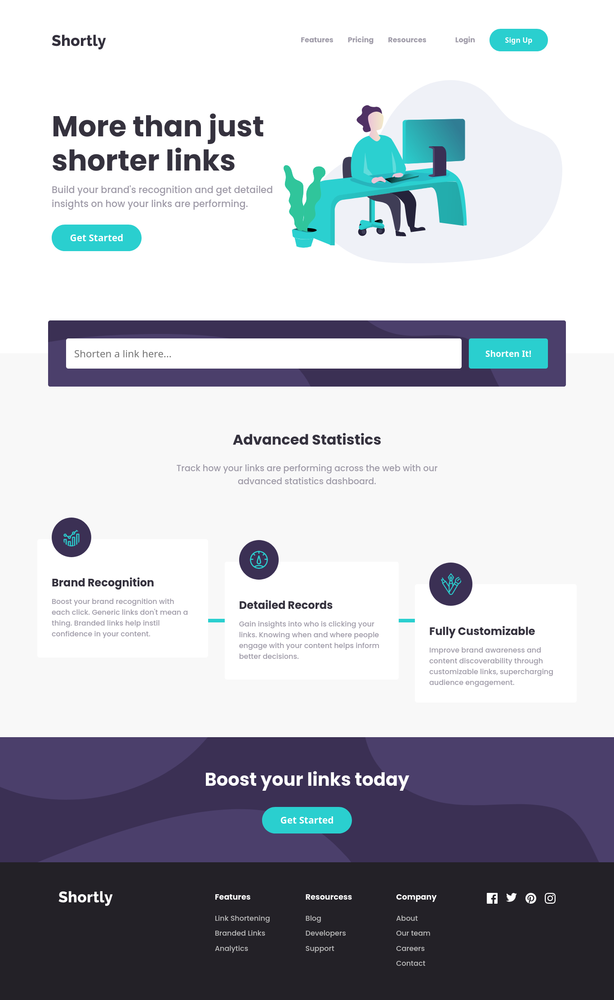

# Shortly

## Table of contents

- [Screenshot](#screenshot)
  - [Links](#links)
- [My process](#my-process)
  - [Built with](#built-with)

### Screenshot

### Links

- [**Live Site**](https://ismail-shortly.netlify.app/)

## Process

### Built with

- Semantic HTML5 markup
- CSS
- Javascript/ES6+
- MVC architecture
- Bundled with parcel
- Shortcode API
- Mobile-first workflow